<<<<<<< HEAD
=======
# slingshot
辅助安全测试项目，使用PyQt5开发

>>>>>>> 6b916657efb20446678de26c521e77fd6a897152
本辅助安全测试项目旨在设计一个GUI界面的安全测试工具，将部分人工经验转换为自动化，集成了渗透过程中常用到的一些功能，分为五个模块：信息收集模块、漏洞扫描模块、编码转换模块、辅助模块和团队模块。以下详细介绍：

​       目前信息收集可将域名扫描、端口扫描、web指纹联动，可输入已收集的子域名列表，自动完成解析、端口扫描、web指纹扫描。

​       域名扫描界面如下，在域名列表处每行输入一个域名，点击"开始扫描"会输出解析结果，得到该域名的子域名和解析对应的IP。如图1所示：

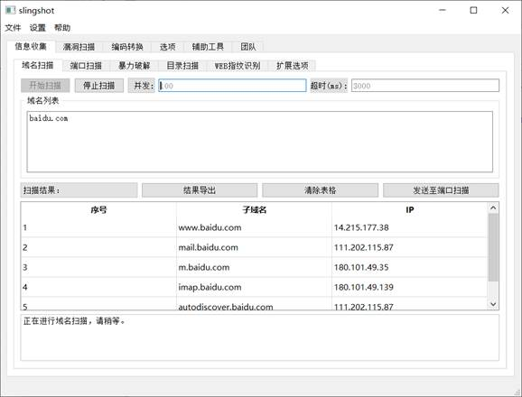

图C-1 信息收集模块 - 域名扫描页面

点击结果导出可以导出为csv格式文件，如图2所示：

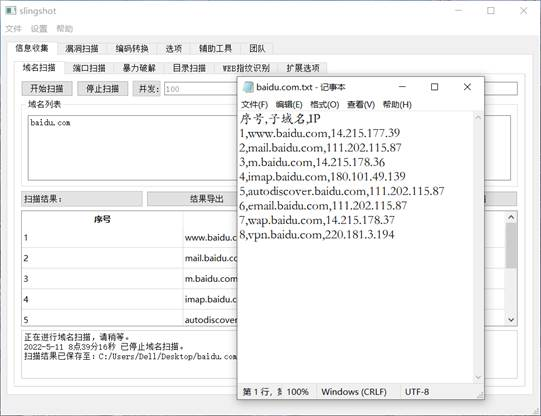

图C-2 信息收集模块 - 域名扫描导出结果

点击发送至端口扫描，可将扫描结果IP进行整合去重发送至端口扫描，如图3所示：

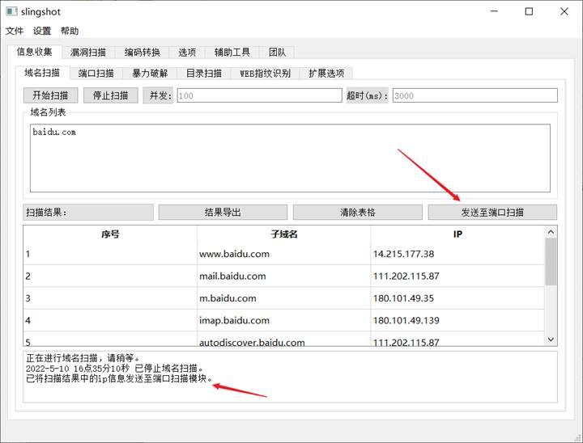

图C-3 信息收集模块 - 域名扫描结果发送至端口扫描

信息收集模块-端口扫描功能，如图4所示：

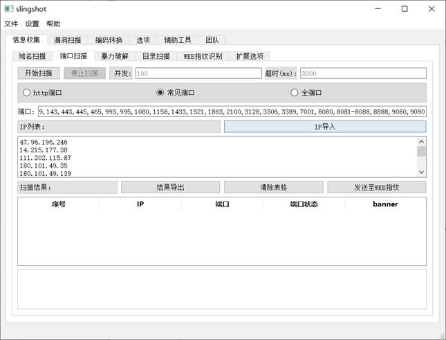

图C-4 信息收集模块-端口扫描

端口扫描是使用Thread实现并发扫描的，使用socket模块实现扫描，使用比较简单，输入端口以及IP列表，点击开始扫描即可，结果在"扫描结果"实时显示，如图5所示：

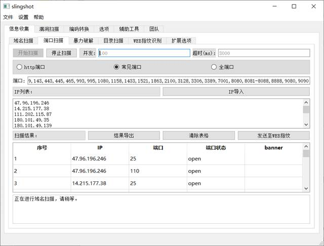

图C-5 信息收集模块-端口扫描结果

暴力破解界面如下，可选择爆破的协议种类，可选择内置的字典或导入自定义字典，爆破结束后可导出结果，如图6所示：

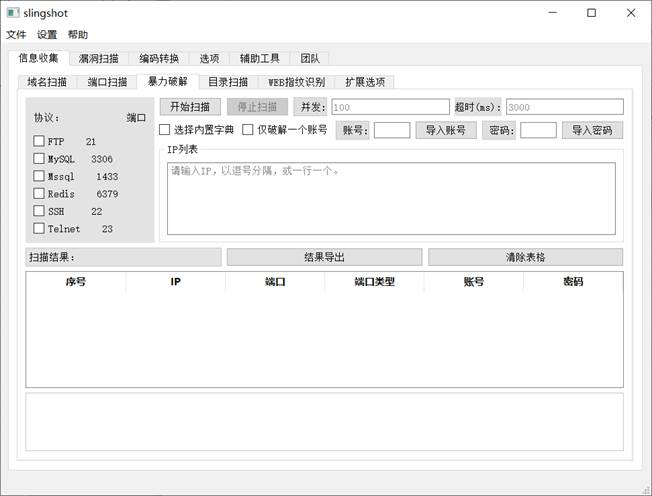

图C-6 信息收集模块-暴力破解页面

目录扫描参考了御剑这个工具，可批量扫描站点目录，可选择扫描文件后缀和响应状态码，扫描结束后同样可以导出结果，如图7所示：

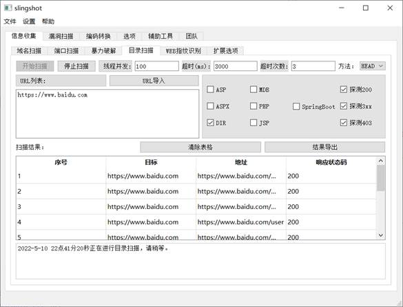

图C-7 信息收集模块-目录扫描页面

​    web指纹识别有两种模式：Fofa指纹库探测和目录匹配式探测，Fofa指纹库探测使用一次请求，通过检查响应包的header，body，title，与数据库中的keys正则匹配，以此来识别站点框架，准确率一般，但胜在可以批量检测；目录匹配式探测，一些网站的特定图片文件、js文件、CSS等静态文件，如favicon.ico、css、logo.ico、js等文件一般不会修改，通过爬虫对这些文件进行抓取并比对md5值，如果和规则库中的Md5一致则说明是同一CMS，但也不排除有些二次开发的CMS会修改这些文件。web指纹识别结果如图8所示：

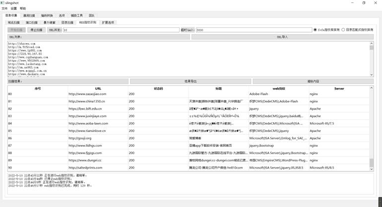

图C-8 信息收集模块-web指纹识别页面

漏洞扫描模块，可批量对url进行sql注入、xss注入漏洞扫描，扫描结果在表格中显示，扫描结束后可导出结果，如图9所示：

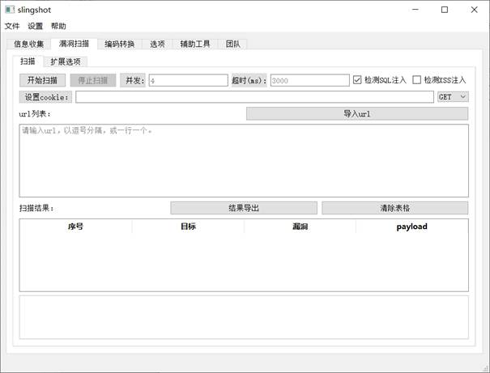

图C-9 漏洞扫描模块

编码转换模块：使用逻辑为，输入编码表示input部分对应的编码，输出编码表示output部分对应的编码。举例如左边是正常编码（aDefault）字符串，要将明文转换成base64编码，那左边输入编码设置成aDefault编码，右边输出编码则应该设置成base64编码，如图10所示。

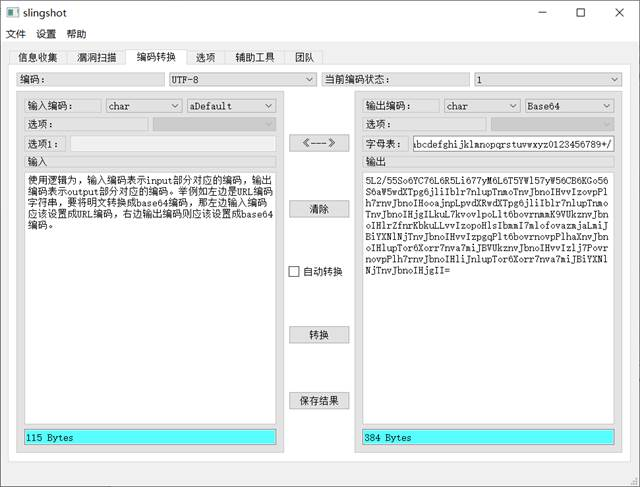

图C-10 编码转换模块 – 编码

解码：

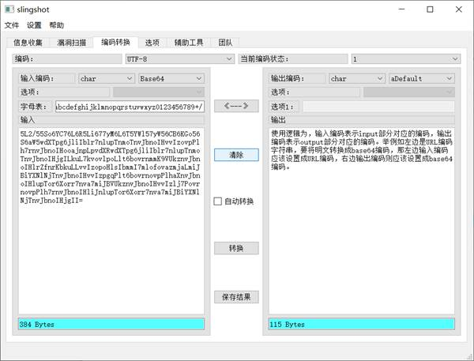

图C-10 编码转换模块 – 解码

可创建多个编码状态，点击右上角的下拉状态栏，切换为2，启用新的编码状态，切换为1后会回到之前的编码状态。点击 《——》，可以交换两边的编码方式；点击清除可以一键清除内容；点击保存结果可以保存编码结果，如图11所示。

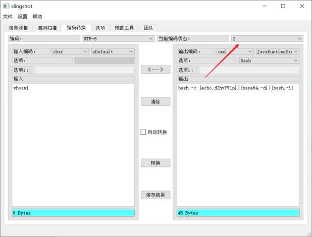

图C-11 编码转换模块 – 切换编码状态

辅助模块-杀软识别功能，识别windows进程中的杀毒软件、安全防护软件的进程名称、进程pid，识别原理为比对杀软字典：

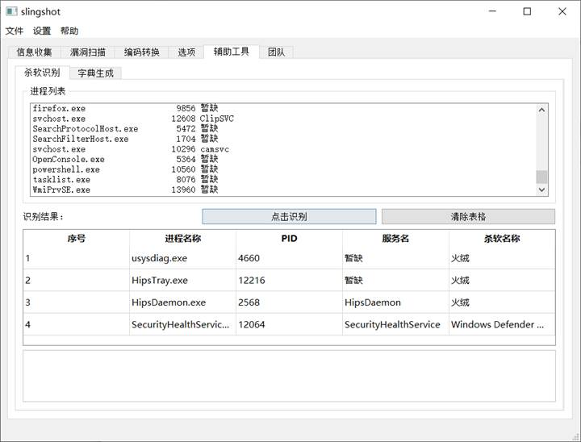

图C-12 辅助模块 – 杀软识别

辅助模块-字典生成功能，输入数据源有A、B、C三项，在字典组合方式中填入这三项的组合方式，字典生成模式为根据组合方式的笛卡尔积，比如组合方式为ACB，每项共有3个数据，那么生成的字典为：A的每一项与C的每一项与B的每一项的笛卡尔积。选择好生成路径后，点击生成，将在该路径下生成字典：

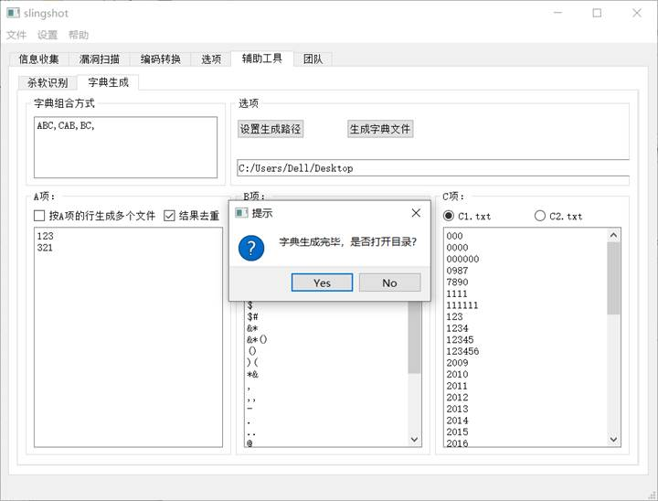

图C-13 辅助模块 – 字典生成

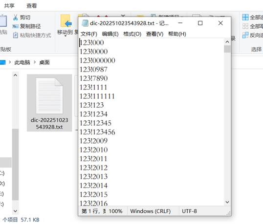

图C-13 辅助模块 – 字典生成 – 查看字典

团队模块主要功能为队内聊天，在同一局域网下，可选择将本程序作为服务端和客户端使用。作为服务端：填写好相关数据后，点击监听，将在本地开启9999端口监听，等待客户端的连接，如图14所示：

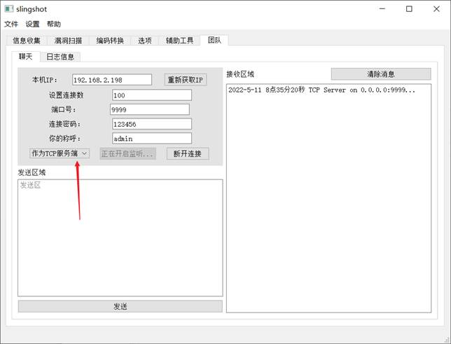

图C-14 团队模块 – 创建服务端

作为客户端：输入好目标IP、端口、连接密码、称呼后点击连接，则会连接到服务端。如图15所示：

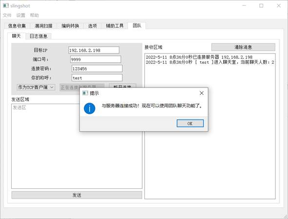

图C-15 团队模块 – 连接服务端

发送消息，进入聊天频道后，可进行聊天功能，左边为消息发送区，右边为消息接收区，当消息太多时可选择清除消息。

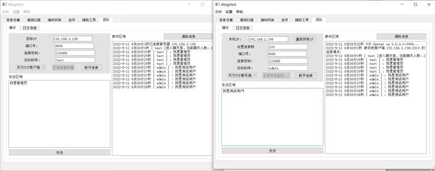

图C-16 团队模块 – 聊天

日志查看可查看历史消息记录。

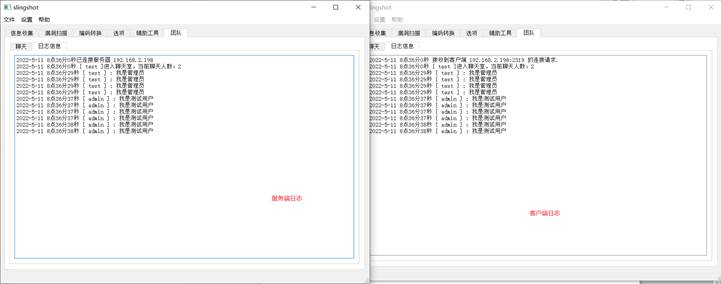

图C-16 团队模块 – 查看聊天日志记录

日志消息会自动保存在程序目录的teamlog目录下：

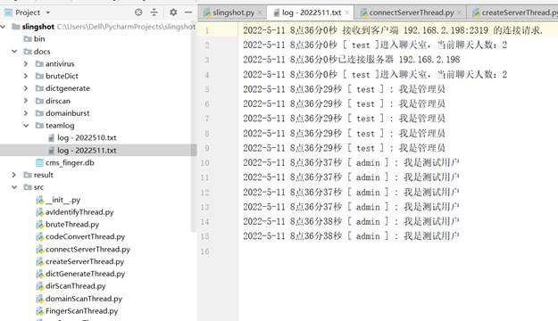

图C-17 团队模块 – 查看日志记录文件

<<<<<<< HEAD
=======

图C-16 团队模块 – 查看聊天日志记录
日志消息会自动保存在程序目录的teamlog目录下：
 
图C-17 团队模块 – 查看日志记录文件
>>>>>>> 6b916657efb20446678de26c521e77fd6a897152
